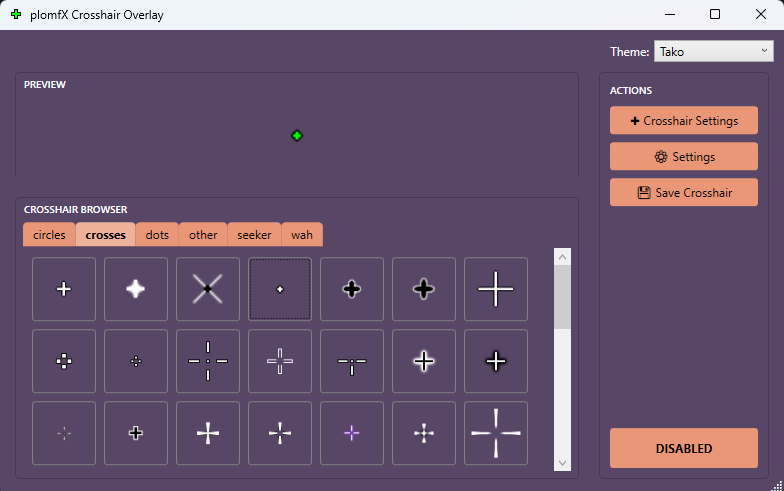
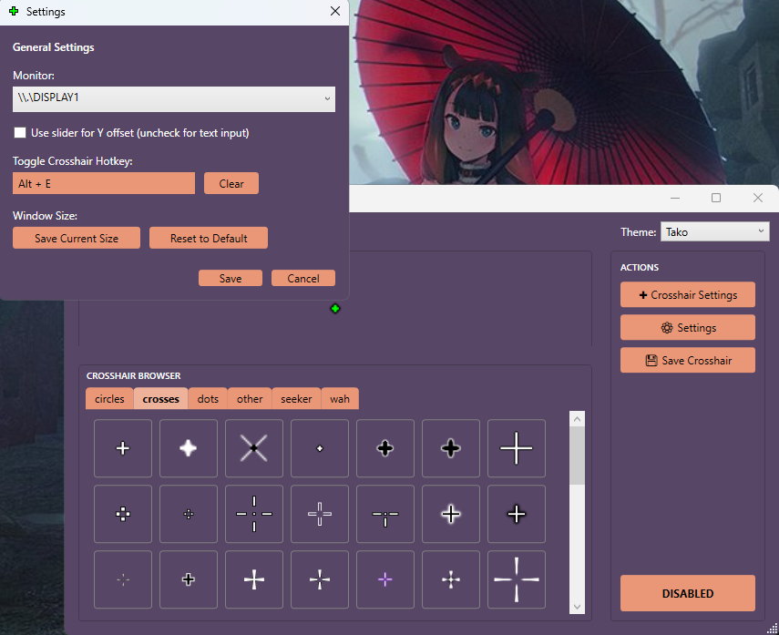
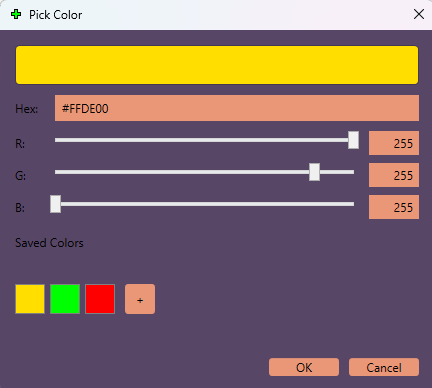
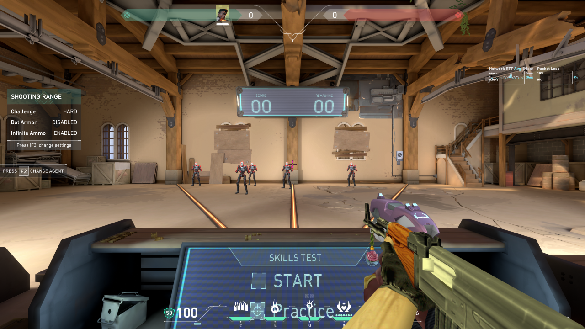

# plomfX

A lightweight, external crosshair overlay for Windows. This only works if you play on Windowed-Fullscreen (making it work for exclusive is too much work and anticheat scary).

## Features

- Browse and select crosshairs from organized folders
- Scale X and Y independently, adjust opacity, crosshair offset
- RGB color tinting with hex input and saved custom colors
- Multi-monitor support
- Custom themes via `themes.txt`
- System tray with enable/disable toggle
- Save your default crosshair to run on startup

## Usage

1. Open the app and pick a crosshair from the browser.
2. Click "Enable Crosshair" to show the overlay.
3. Use "Crosshair Settings" to adjust scale, opacity, and color tint.
4. Click "Save Crosshair" to set it as your default for next launch.
5. Minimize to tray. Right-click the tray icon for quick enable/disable.

## Customize

Edit `themes.txt` located next to the executable and add your own theme in the format of:

    ThemeName: PrimaryR,G,B : SecondaryR,G,B

Use your own custom crosshairs by putting them in `./crosshairs/other` or make your own directory

## Screenshots

## Installation

1. Install the .NET 8 Desktop Runtime if you don't already have it.
2. Download the latest `plomfX-vX.X.X.zip` from Releases.
3. Extract the zip anywhere.
4. Run `plomfX.exe`.

## Requirements

- Windows 10 or 11 (64-bit)
- [.NET 8 Desktop Runtime](https://dotnet.microsoft.com/en-us/download/dotnet/8.0) (x64)
